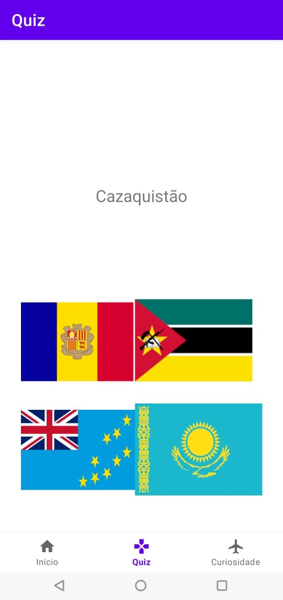
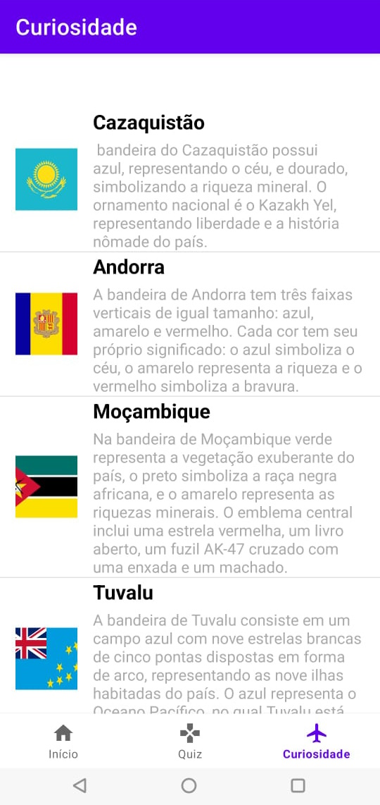

##### Aluno: Wilker Sebastian Afonso Pereira

### Descrição geral
Este repositório é para o trabalho final da disciplina de Programação de Dispositivos Móveis. Aqui está o código do BandeiraX, um app de quiz de bandeiras feito em Kotlin. Esse app é uma versão melhorada de um trabalho anterior, onde o quiz era mais simples. No BandeiraX, você pode responder perguntas sobre bandeiras e aprender curiosidades sobre elas. O app tem novos recursos e está mais completo, como vou descrever a seguir.

### Imagens do trabalho anterior

##### Quiz

##### Curiosidades

### Papéis

- Administrador
- Usuário Comum

### Requisitos funcionais

#### 1. Funcionalidades do Administrador

##### Gerenciar Usuários
- Visualizar a lista de usuários cadastrados.
- Banir usuários que não estão em conformidade com as regras.

##### Visualizar Estatísticas
- Acessar relatórios de uso do aplicativo, incluindo:
  - Número total de usuários.
  - Pontuações médias dos quizzes.
  - Taxas de acerto/erro para perguntas.

#### 2. Funcionalidades do Usuário Comum

##### Participar do Quiz
- Responder perguntas de múltipla escolha sobre bandeiras.
- Receber feedback imediato após cada resposta com curiosidades sobre a bandeira.

##### Verificar Pontuação
- Visualizar a pontuação atual após cada quiz.
- Acessar a placa de líderes para comparar pontuações com outros usuários.

##### Perfil do Usuário
- Editar informações pessoais (nome, e-mail, imagem, senha).
- Visualizar o histórico de quizzes realizados e suas respectivas pontuações.

#### 3. Entradas Necessárias
- **Para o Administrador:**
  - Dados dos usuários (nome, e-mail, status de banimento).
  - Dados de acesso para visualização de estatísticas.

- **Para o Usuário Comum:**
  - Respostas às perguntas do quiz.
  - Informações pessoais para o perfil.
  - Dados de login e registro (nome, e-mail, senha).

#### 4. Saídas do App
- **Para o Administrador:**
  - Relatório de uso com número total de usuários, pontuações médias, taxas de acerto/erro.
  - Listagem de usuários com opções de gerenciamento

- **Para o Usuário Comum:**
  - Feedback sobre as respostas do quiz
  - Curiosidades sobre bandeiras após cada resposta.
  - Placa de líderes com as melhores pontuações.

#### 5. Acessebilidade

- Suporte as linguas (português. inglês, espanhol)
- Opção de tema escuro e claro

### Requisitos Não Funcionais

#### 1. Segurança
- Encriptação de Dados Sensíveis: Uso de bcrypt para encriptar senhas e dados sensíveis no servidor.
- Comunicação Segura: Uso de HTTPS para todas as comunicações entre o aplicativo móvel e o servidor.
- Validação de Email: Envio de emails de validação para novos usuários com links únicos e expirados.

#### 3. Armazenamento e Sincronização de Dados
- Servidor Web: Implementação em Node.js com Express.
- Banco de Dados: Uso de PostgreSQL para armazenamento de dados no servidor.
- Cache Local: Uso do Room Database no aplicativo para cache local de dados, minimizando requisições ao servidor e melhorando a performance offline.